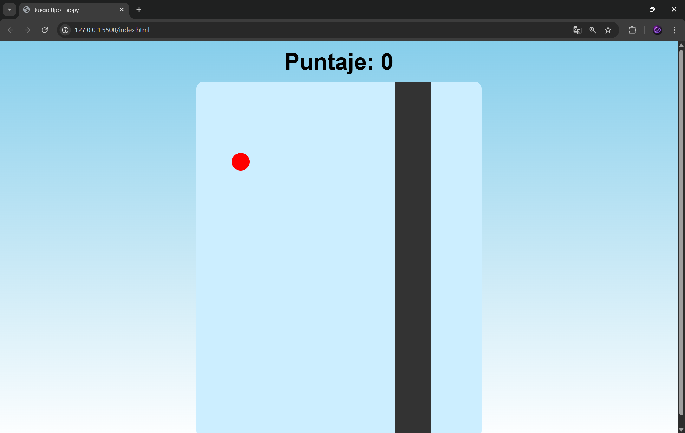

# 🐦 Juego tipo Flappy Bird (JavaScript)

Un mini juego web inspirado en **Flappy Bird**, desarrollado con **HTML, CSS y JavaScript puro**.
El objetivo es simple: controlar al personaje y evitar chocar con los obstáculos mientras sumas puntos.

---

## 🎮 Demo del juego

Haz clic en la pantalla para saltar y evita los bloques.

---

## 🚀 Características

* 🎯 Sistema de puntaje en tiempo real
* 🧠 Lógica de colisiones
* 🌌 Animaciones con CSS (`@keyframes`)
* 🔄 Reinicio de juego
* ⚡ Física básica (gravedad y salto)
* 🎨 Interfaz simple y limpia

---

## 🛠️ Tecnologías utilizadas

* HTML5
* CSS3
* JavaScript (Vanilla JS)

---

## 📂 Estructura del proyecto

```
📁 flappy-game
 ├── index.html
 ├── style.css
 └── index.js
```

---

## ▶️ Cómo ejecutar el proyecto

1. Descarga o clona el repositorio:

```
git clone https://github.com/tu-usuario/flappy-game.git
```

2. Abre el archivo `index.html` en tu navegador.


---

## 🎯 Cómo jugar

* Haz clic en la pantalla para hacer saltar al personaje
* Evita chocar con los obstáculos
* Cada obstáculo superado suma puntos
* Si pierdes, puedes reiniciar el juego

---

📸 Captura (opcional)



## 👨‍💻 Autor

Luis Orlando Flores Canizales

---


